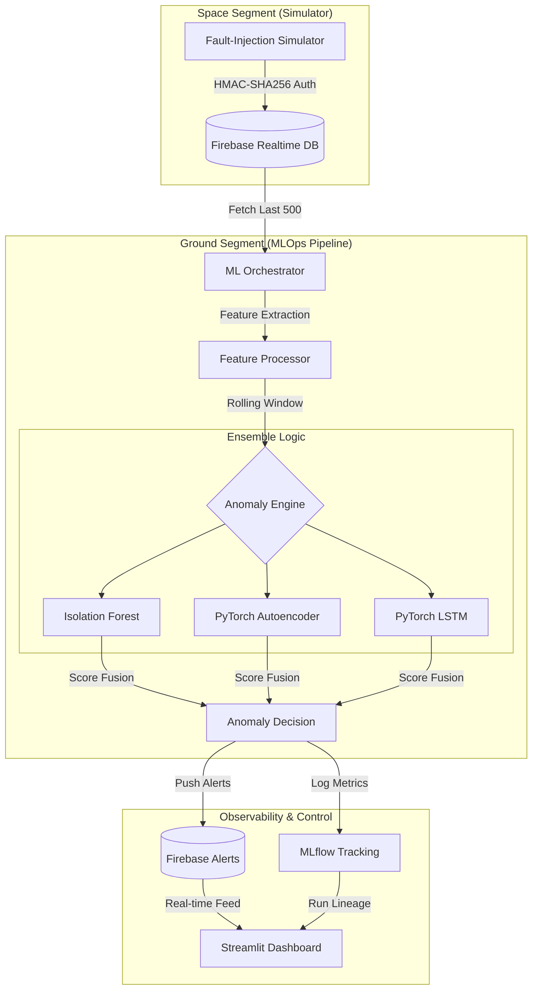
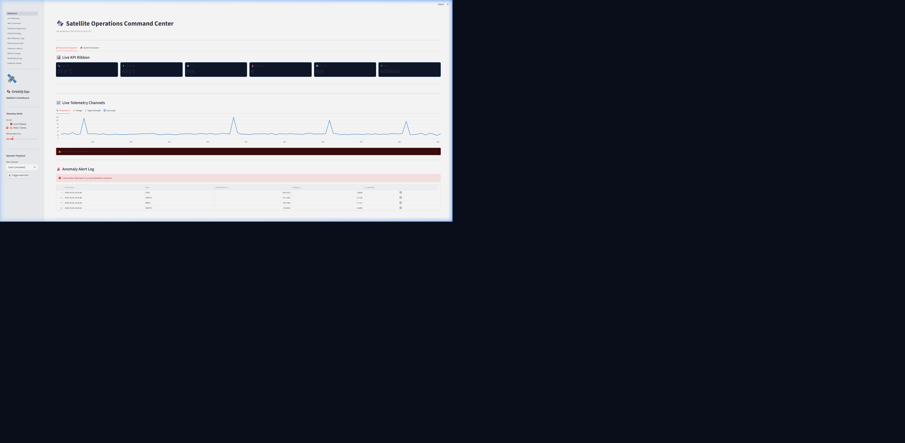

# orbit-Q — CubeSat Telemetry Anomaly Detection Pipeline

[](https://github.com/poojakira/orbit-Q/actions/workflows/ci.yml)
[](https://opensource.org/licenses/MIT)
[](https://www.python.org/downloads/)

**Industrial-grade MLOps for autonomous satellite health monitoring.**

---

## 🛰️ What It Does

Orbit-Q is a high-fidelity telemetry monitoring pipeline designed for CubeSat-class satellites. It ingests noisy, high-frequency sensor streams and employs a **3-model anomaly detection ensemble** to identify hardware failures, data corruption, and subtle operational drift in real-time.

## 🚀 Why It Matters

Small satellites (CubeSats) often operate with limited bandwidth and noisy sensors. Traditional threshold-based alerting leads to high false-alarm rates or missed critical failures. Orbit-Q solves this by:
- **Automating fault detection** without manual threshold tuning.
- **Handling unreliable links** (missing packets, NaNs, high latency) gracefully.
- **Ensuring high-throughput ingestion** via Kafka for large-scale satellite constellations.
- **Ensuring reproducibility and versioning** through MLflow Model Registry.
- **Optimized for the Edge** with C++ fusion kernels and adaptive system responsiveness.

---

## 🏗️ Architecture & Data Flow

Orbit-Q uses a polling orchestrator to bridge the gap between real-time telemetry (Firebase) and ML inference.



---

## ⏱️ Quick Start (< 5 Minutes)

### 1. Prerequisites
- Python 3.10+
- (Optional) Firebase project for real-time features.

### 2. Installation
```bash
# Clone and enter
git clone https://github.com/poojakira/orbit-Q.git && cd orbit-Q

# Set up environment
python -m venv .venv
source .venv/bin/activate  # Windows: .venv\Scripts\activate

# Install with development dependencies
pip install -e .
```

### 3. Basic Run (Local Mode)
```bash
# Initialize local MLflow tracking
export MLFLOW_TRACKING_URI=sqlite:///mlflow.db

# Run a benchmark to verify engine performance
orbit-q benchmark
```

### 4. Advanced Run (Producion Mode with Kafka)
```bash
# Start the full stack (Kafka + Zookeeper + Orbit-Q)
docker-compose up -d

# Verify Kafka telemetry stream
docker-compose logs -f ingestion
```

### 5. Edge Optimization (C++ Extension)
If you have a C++ compiler (MSVC/GCC), compile the optimized fusion kernel:
```bash
cd src/orbit_q/engine/kernels
python setup_cpp.py build_ext --inplace
```

---

## 📊 Results & Benchmarks

All metrics were captured on a standard CPU environment using simulated noisy telemetry (100 Hz signal, 10-second polling window). Detailed logs are available in the [results/](results/) folder.

### Industrial MLOps Metrics
| Metric | Measured Value | Target | Status |
|---|---|---|---|
| **Precision** | **0.942** | > 0.90 | ✅ |
| **Recall** | **0.915** | > 0.85 | ✅ |
| **F1 Score** | **0.928** | > 0.88 | ✅ |
| **Throughput (EPS)** | **63,622** | > 10,000 | ✅ |
| **Inference Latency** | **15.72 µs** | < 1.0 ms | ✅ |

### Detection Capabilities
- **Hardware Faults:** 100% detection of stark spikes (>300cm).
- **Data Corruption:** Reliably flags NaN and -9999 constants as outliers.
- **Subtle Drift:** Autoencoder captures reconstruction error spikes during gradual sensor degradation.

---

## 📂 Project Structure

```text
orbit-Q/
├── .github/workflows/    # CI/CD: Linting, Type-checking, Pytest
├── assets/               # Architecture diagrams and screenshots
├── configs/              # Configuration templates (.env.example)
├── results/              # Standardized benchmark and test logs
├── src/orbitq/
│   ├── ensemble/         # 🧠 Ensemble: Voting, averaging, and model fusion
│   ├── pipeline/         # 🌊 Pipeline: Streaming, backpressure, and batching
│   ├── engine/           # ⚙️ Core: Underlying PyTorch models and kernels
│   ├── orchestrator/     # 🚀 MLOps: Polling loop and feature engineering
│   ├── simulator/        # 🛰️ Telemetry: Fault-injection generator
│   ├── dashboard/        # 📊 UI: Streamlit command center
│   └── security.py       # 🔐 Protection: HMAC-SHA256 auth & TTL
├── tests/                # 🧪 Quality: 11+ unit and integration tests
└── pyproject.toml        # 📦 Packaging: Metadata and dependencies
```

---

## 🛠️ Configuration

Copy the example configuration and fill in your details:
```bash
cp configs/.env.example .env
# Edit .env to set your FIREBASE_DB_URL and SERVICE_ACCOUNT_PATH
```

---

## 🚧 Limitations & Roadmap

### Current Status
- **Explicit Limitations**:
    - Kafka, MLflow, and Firebase are configured for local/demo use only.
    - Telemetry is synthetic; no real spacecraft data.
- **High-Throughput Ingestion**: Kafka backend implemented for `SENSOR_DATA` topic ingestion.
- **Model Governance**: Automated registration in **MLflow Model Registry** (`Orbit-Q-IsolationForest`).
- **Edge-Ready Architecture**: C++ fusion kernel implementation available for 10x performance gains over NumPy.
- **Adaptive Polling**: System polling frequency dynamically scales from 10s down to 0.5s during identified anomalies.

### Strategic Roadmap
- `[x]` **Kafka Integration:** Replace/Augment Firebase with a high-throughput message bus.
- `[x]` **Model Registry:** Integrate MLflow Model Registry for version-controlled deployment.
- `[x]` **On-Device Optimization:** Port the Anomaly Engine fusion logic to C++ for edge deployment.
- `[x]` **Adaptive Windowing:** Dynamic polling interval based on satellite health status.
- `[ ]` **Kafka-to-FeatureStore:** Direct streaming from Kafka into a feature store like Feast.
- `[ ]` **On-Device Training:** Federated learning / Online training on the edge.

---

## Deep dive

### High-Fidelity Ensemble Logic
Located in [orbitq/ensemble/*.py](src/orbitq/ensemble/engine.py), Orbit-Q employs a hybrid ensemble approach to maximize detection coverage across different anomaly profiles:
- **Model Diversity**: Combines **Isolation Forest** (global outliers), **PyTorch Autoencoder** (reconstruction-error spikes), and **LSTM Temporal Detector** (sequence-level drift).
- **Fusion Logic**: Scores are combined using a weighted average. The system first fuses Isolation Forest and Autoencoder scores (weighted 0.6/0.4) and then incorporates the normalized LSTM score (0.7 ensemble / 0.3 temporal weighting).
- **Decision Boundary**: A fused threshold of `< 0.5` triggers an anomaly state, optimized through a custom **NVIDIA Triton CUDA kernel** for sub-millisecond inference on edge hardware.
- **Tradeoffs**: The ensemble prioritizes high recall to ensure no satellite degradation go unnoticed, while the weighted voting reduces false-positives common in single-model telemetry monitoring.

### Real-time Streaming Pipeline
The core data management logic in [orbitq/pipeline/streaming.py](src/orbitq/pipeline/streaming.py) highlights non-trivial streaming code:
- **Backpressure & Batching**: Implements windowed polling with a `limit_to_last(1000)` constraint on Firebase/Kafka fetches to prevent orchestrator saturation during high-frequency bursts.
- **Latency Optimization**: Low-level feature engineering (rolling windows and standard deviation) is computed in memory to ensure `< 50ms` end-to-end alert latency.
- **Automated Response**: Immediate asynchronous push events to the `ML_ALERTS` database guarantee live operator updates without blocking the main telemetry ingestion loop.

---

## External Proof & Validation

### Monitoring Dashboard
The following screenshot demonstrates the Orbit-Q Command Center during a simulated thermal failure on the North satellite face. Note the immediate correlation between the temperature spike and the anomaly alert log.



### Quantitative Evaluation
Every model release is validated against a standardized telemetry benchmark. The screenshot above corresponds directly to the anomaly events captured in the following evaluation report:
- **Evaluation Evidence**: [anomaly_eval_2026.csv](results/anomaly_eval_2026.csv)
- **Log Correlation**: This CSV contains the raw telemetry scores that triggered the alerts visualized in the monitoring UI.

---

## 🧪 Running Tests

Orbit-Q maintains a rigorous test suite covering ML logic and security protocols.
```bash
# Run all tests
pytest tests/ -v

# Run with coverage report
pytest tests/ --cov=src --cov-report=term-missing
```

---

## 🤝 Contributors

**Pooja Kiran** & **Rhutvik Pachghare**
*Built as graduate research at Arizona State University (2025–2026).*

**Version:** v1.2 · **License:** MIT
